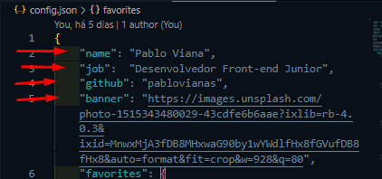
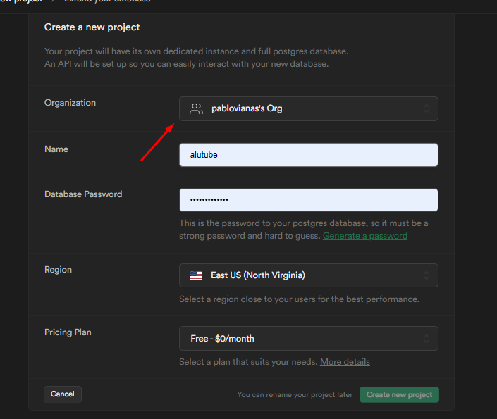
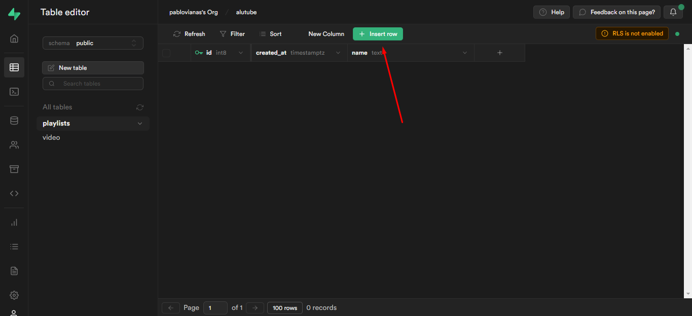
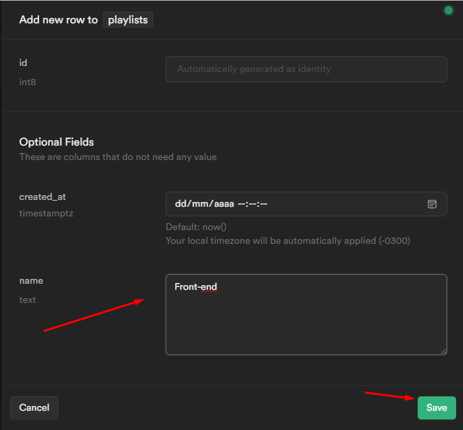
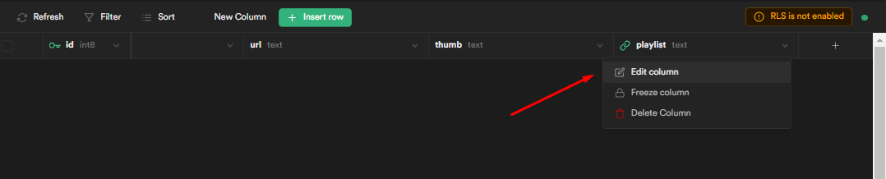
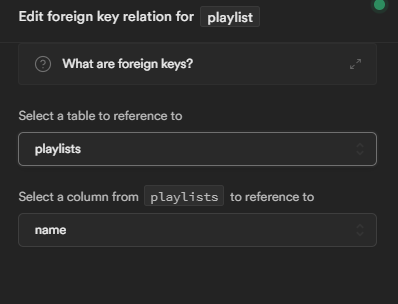

# Alutube

Projeto construído durante a imersão react da Alura. Nele, é possível adicionar seu vídeo preferido do YouTube, além de categorizar para uma melhor organização. <br>

Como desafio, foi criado uma nova página onde é possível reproduzir o vídeo onde o usuário clicou. <br>

Nesse readme, será ensinado brevemente como criar o seu próprio banco de dados e modificar o arquivo config.json para ser criado do seu jeito 🖤

# Executando o projeto

- Baixar o zip do projeto
- Abrir com o vscode e utilizar o comando `npm i` para baixar as dependências
- Executar o comando `npm run dev` para rodar o servidor do projeto.

# O que foi utilizado no projeto
- React
- NextJS
- styled-components
- react-loading-skeleton (adicionar um preview no carregamento dos itens)
- ContextApi (dark mode)
- Supabase (para o backend)

# Aprendizado

Neste projeto, foi possível entender melhor o uso dos hooks do React, além do poder do ContextApi para a utilizar alguma funcionalidade em várias pagínas e componentes. <br><br>
E também como criar um hook próprio para utilização em projetos futuros, principalmente a utilização do Supabase como ferramenta de backend as a service para facilitar a integração com o backend.

# Se desafie, deixe o projeto com o seu jeito!

O projeto contém informações de nome, job, github e banner em um arquivo chamado config.json. Nele podem ser alterado para suas informações. Também pode ser alterado os seus canais favoritos. 

# Configurando o arquivo config.json



# Configurando o banco de dados para inserir suas próprias informações

Primeiro passo é realizar o login no Supabase utilizando o seu github.

Com o supabase aberto, é necessário criar um novo projeto ou "New Project.



Após criado, ao lado esquerdo escolha a opção table editor e em Insert Row. 

Importante: Na hora de criar as tabelas, é necessário desabilitar a opção RLS.



A primeira tabela se chamará playlists que irá ter os seguintes dados:
-id: automático
-data de criação: automático
-name: nome para playlist (tipo text)



A segunda tabela terá o nome de video, tendo as seguintes informações:
-id: automático
-data de criação: automático
-title: título do vídeo (tipo text)
-url: url do vídeo (tipo text)
-thumb: thumbnail do vídeo gerada automática sendo vídeo do youtube (tipo text)
-playlist: nessa coluna terá o respectivo nome da playlist (tipo text). Importante: é necessário configurar como uma foreign key

## Configurando a foreign key:

Basta ir em edit column, terá um botão chamado add relation. Selecionamos a tabela playlists e a coluna nome, então ambas terão uma ligação. Por fim, basta ir em save.





# Criando o arquivo suas chaves e arquivo .env.local

Após o projeto criado, no menu lateral basta ir em Project Settings->API, as informações que necessitamos são apenas o project url e o anon public key. 

## Criando arquivo .env.local

É necessário criar um arquivo chamado .env.local na raiz da aplicação e incluir a url e a chaves nesse arquivo. O react fará todo o restante.

```
NEXT_PUBLIC_SUPABASE_URL= // paste your project url here
NEXT_PUBLIC_SUPABASE_ANON_KEY= // paste your supabase anon key here
```

Não esqueça de adicionar ao gitignore. 
<br>
<br>
Com isso, conseguirá criar um projeto do seu jeito. 